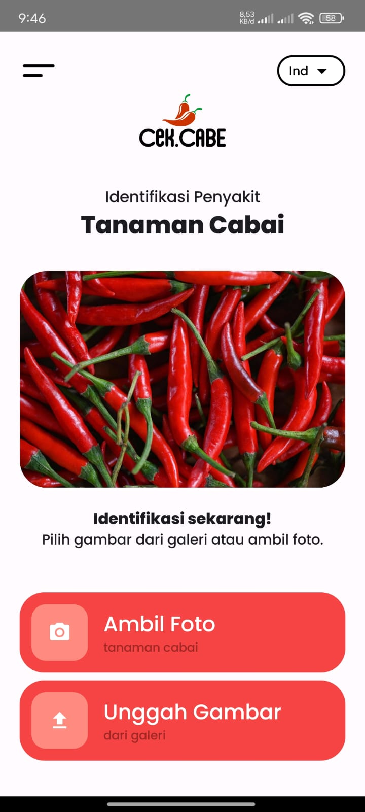
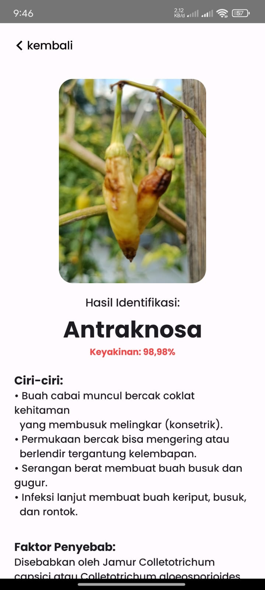

# 🌶️ Chili Disease Detection App (CNN + Kotlin)

Aplikasi Android untuk mendeteksi penyakit pada tanaman cabai menggunakan **Convolutional Neural Network (CNN)** yang diimplementasikan dengan **TensorFlow Lite**.  
Dikembangkan menggunakan **Kotlin** dan hasil model dilatih dengan **MobileNetV3**.

## 📱 Fitur Utama
- Klasifikasi penyakit cabai berdasarkan gambar daun/buah.  
- Menampilkan hasil prediksi berupa:
  - Jenis penyakit  
  - Akurasi prediksi  
  - Penyebab penyakit  
  - Langkah penanganan yang disarankan  
- Tampilan sederhana dan mudah digunakan.  

## 🛠️ Tech Stack
- **Kotlin (Android Development)**  
- **TensorFlow Lite (CNN Model Integration)**  
- **MobileNetV3 (Pre-trained CNN Architecture)**  
- **Android Studio / Gradle**  

## 📸 Screenshot

## 📥 Download APK
👉 [Download disini!](https://drive.google.com/file/d/1YIc_r65-eDBhyx7Osbudo8_hKsK5Uqi8/view?usp=sharing)
